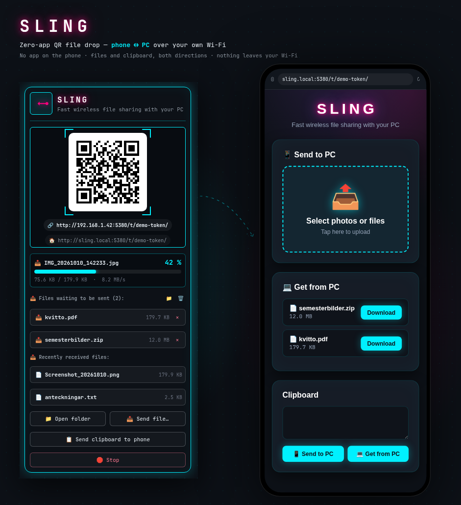

# Sling 🚀📱💻
**Zero-App QR File Sharing Between Phone & PC for [Omarchy](https://omarchy.org) / Quickshell**

Sling files between your smartphone (iPhone or Android) and your Linux PC with **zero apps to install on your mobile device**. Scan the QR code in the bar and the transfer portal opens in your phone's browser.


Current version: `1.3.0`.

---

## ✨ Features

* **📷 Zero Mobile Installation:** Point your regular phone camera at the QR code in the top bar and the transfer portal opens on your local Wi-Fi.
* **📱 Send from Phone to PC:** Tap to pick photos, videos or documents — files land in `~/Downloads/Sling/Received/`.
* **💻 Send from PC to Phone:** Put files in `~/Downloads/Sling/Send/`, or press **📤 Send file…** in the panel (file picker), and download them on the phone with one tap. Queued files are symlinked, not copied, so a 2 GB video costs no extra disk.
* **📊 Live Progress:** A transfer dock in the panel shows direction, file name, a large percentage, the filled bar and MB/s while a file moves — and the bar label itself switches to the percentage, so a long transfer is visible without opening anything. The phone's page has its own progress bar during uploads.
* **🔔 Native Desktop Notifications:** A desktop notification with the file count arrives as soon as transfers complete.
* **🔐 Token-gated:** Every request must carry a random token in the URL (`/t/<token>/`), created at start and carried by the QR code. Without it the server answers 403 and reveals nothing.
* **💤 Disarms itself:** The server exits after 15 minutes without traffic (`SLING_IDLE_TIMEOUT`), so leaving it started does not leave a permanent door open.
* **🏠 A name to remember:** `http://sling.local:5380` is published over mDNS (Avahi) and shown in the panel, so the address survives the router handing out a new IP. The QR code still carries the IP, because Android does not resolve `.local` reliably.
* **🌐 Automatic System & Browser Language (i18n):** English, Svenska, Nederlands, 日本語, Deutsch, Français, Español, 中文 — on both the PC and the phone.
* **🔒 100% Local & Private:** Direct peer-to-peer over your local Wi-Fi network. No cloud, no external servers, no tracking.

---

## 📦 Requirements

| Dependency | Needed for | Install (Arch/Omarchy) |
|---|---|---|
| `qrencode` | the QR code (**required**) | `sudo pacman -S qrencode` |
| `avahi` | the `sling.local` name (optional) | `sudo pacman -S avahi && sudo systemctl enable --now avahi-daemon` |
| `zenity` | the **Send file…** picker (optional) | `sudo pacman -S zenity` |
| `libnotify` | desktop notifications (optional) | usually already installed |
| `wl-clipboard` | the copy-link button (optional) | usually already installed |

Only `qrencode` is required; the rest degrade gracefully — the panel reports what is missing (`omarchy-sling status` → `"qr_ok": false`) instead of showing a blank square. The daemon itself is Python 3 standard library only.

Verify a build at any time — `selftest` starts its own server on a spare port in a scratch directory and runs **50 checks**: files of four sizes uploaded and compared byte for byte, the token gate (403), the size cap (413), duplicate names, queue deduplication and removal (the source file always survives), the connection cap and read deadline (threads and file descriptors stay bounded when a silent peer opens more connections than the cap), the clipboard in both directions (the shared text never reaches argv or a notification, and the slot, the token file and the state directory are created with 0600/0700 from the start, never chmodded afterwards), and that a running transfer is visible through both the server's `/status` and the CLI the panel polls:

```bash
omarchy-sling selftest
```

---

## 🛠️ Installation

```bash
omarchy plugin add https://github.com/alexwest1981/sling.git --enable
```

The widget runs the CLI that ships beside it (`bin/omarchy-sling` inside the plugin folder), so
nothing needs to be on your `PATH`. For terminal use, symlink it:

```bash
ln -s ~/.config/omarchy/plugins/io.github.alexwest1981.sling/bin/omarchy-sling ~/.local/bin/omarchy-sling
```

**The one manual step** — and the reason the marketplace lists Sling as *manual setup* — is the
firewall line below: a stock Omarchy enables `ufw` with `deny incoming`, and Sling needs the port for
the phone to reach it. One command, once.

### Allow Sling in your Firewall (Port 5380)

Linux firewalls block incoming connections from the local network by default. Allow incoming traffic on port `5380/tcp`:

* **If you use UFW (Omarchy default):**
  ```bash
  sudo ufw allow 5380/tcp
  ```

* **If you use firewalld:**
  ```bash
  sudo firewall-cmd --add-port=5380/tcp --permanent
  sudo firewall-cmd --reload
  ```

* **If you use nftables:**
  ```bash
  sudo nft add rule inet filter input tcp dport 5380 accept
  ```

### Restart Omarchy Shell

```bash
omarchy-restart-shell
```

---

## 🕹️ Usage

**From the panel:** click the bar icon — the server starts and the QR code appears inside the neon reticle. **Drag a file onto the bar icon** and it is queued for the phone immediately (no picker window). Below it: the `sling.local` address, the transfer dock (which reads *Ready — waiting for a file* when nothing is moving), the send queue and the last received files. The queue lists the first five files waiting for the phone with a `✕` per file, plus **📁 Open Send folder** and **🗑 Clear all** — a `+ N more…` line opens the folder. Buttons: **📁 Open folder**, **📤 Send file…**, **📋 Send clipboard to phone** (the phone reads it in its *Clipboard* card, and can paste text back the other way), **▶ Start / 🛑 Stop**.

The panel and the phone page, both drawn from the code itself — `tools/preview/` renders them:



**From the terminal:**

```bash
omarchy-sling start                  # start the server, print the token URL
omarchy-sling status                 # JSON: running, url, mdns_url, qr_ok, active, queues
omarchy-sling send ~/Pictures/a.jpg  # queue files for the phone (symlinked, never twice)
omarchy-sling send-pick              # queue files via a file picker
omarchy-sling remove a.jpg           # unlink one file from the queue (the original is untouched)
omarchy-sling clear                  # empty the whole queue
omarchy-sling clip                   # share the PC clipboard with the phone (panel button too)
omarchy-sling copy [mdns]            # put the token URL in the clipboard (wm-agnostic stdin, never argv)
omarchy-sling open [send|received]   # open the Received (default) or Send folder
omarchy-sling stop                   # stop now (SIGTERM, then SIGKILL)
omarchy-sling selftest               # the 50 checks above
```

`status` reports the running transfer under `active` (direction, file name, bytes, total, percentage and speed), read from the server itself — the same values the panel draws.

Environment overrides: `SLING_PORT` (5380), `SLING_IDLE_TIMEOUT` (900 s), `SLING_MAX_UPLOAD` (2 GiB per request), `SLING_MAX_CONNECTIONS` (32), `SLING_SOCKET_TIMEOUT` (30 s), `SLING_CLIP_MAX` (64 KB), `SLING_BASE_DIR` (`~/Downloads/Sling`), `SLING_MDNS_NAME` (`sling`).

---

## 🔐 Security model

The server has to listen on `0.0.0.0:5380` — the phone must reach it — so the protection is not the bind address but three gates:

1. **A token in the path.** Everything lives under `/t/<token>/`; a request without it gets 403 and learns nothing. The token is regenerated on every start and only appears in the panel, the QR code and `status`.
2. **Auto-disarm.** No traffic for `SLING_IDLE_TIMEOUT` (15 min by default) and the process exits, deleting its token.
3. **A hard size cap.** `SLING_MAX_UPLOAD` is checked before the body is read, so a hostile client cannot fill the disk.
4. **Bounded connections and reads.** The token is checked only once a request has been read, so the socket has to be bounded before that: at most `SLING_MAX_CONNECTIONS` (32) connections are accepted at a time — the rest get `503` and are closed instead of being queued — and every connection has a `SLING_SOCKET_TIMEOUT` (30 s) deadline per read and write, so a peer that connects and then says nothing releases its thread and file descriptor. Measured: 200 silent connections take the server to 34 threads / 36 fds (2/4 at rest) and back down again; before the cap the same 200 held 202 threads / 204 fds.
5. **The clipboard is opt-in, one direction at a time.** The phone can only read what *you* pushed with **📋 Send clipboard to phone** (or `omarchy-sling clip`): a single `0600` file in `~/Downloads/Sling/`, at most `SLING_CLIP_MAX` (64 KB), served only when the phone asks for it. Nothing else from your clipboard is ever exposed. Text sent from the phone goes to your clipboard through `wl-copy` on stdin — like the token URL, it never appears in a process argument list, and the notification says only that something arrived, never what.

Traffic is plain HTTP (no TLS) — anyone able to sniff your Wi-Fi can see file contents in transit. On your own home network that is the tradeoff; on an open network, transfer only between devices you trust.

Uploads are streamed straight to disk with a bounded buffer (a 150 MB file costs about 0.6 MB of resident memory, measured), filenames are HTML-escaped so a crafted name cannot inject script into the phone's page, and downloads are sent with an RFC 5987 encoded `Content-Disposition` so a filename cannot inject headers.

**The token never appears in a process argument list.** Another local account can read `ps` output, so the URL — which carries the token — goes to `qrencode` on stdin, and clipboard copies pipe it to `wl-copy` instead of passing it as an argument. Notifications carry only a file *count*, never file names. The token file is `0600` inside a `0700` directory, the server log is `0600` for the same reason (it names received files), and `selftest` asserts the stdin-not-argv rule for both the QR code and the clipboard.

---

## 🗑️ Removal

```bash
omarchy plugin remove io.github.alexwest1981.sling
rm -f ~/.local/bin/omarchy-sling              # only if you made the symlink
rm -rf ~/Downloads/Sling ~/.local/state/sling    # received files, send queue and the log
```

Nothing else is written outside those paths, so removing them removes the plugin.

---

## 🎨 Design

The neon palette: electric cyan `#00f0ff` for the reticle around the QR code, the progress bar and the control accents; hot magenta `#ff007f` for the wordmark and the panel icon; obsidian `#0d1117` as the surface. The phone's page and the bar panel share it — the panel keeps your bar's own border and typography, so the widget still belongs in the bar.

---

## 🛠️ Troubleshooting & Checklist

* **Same Wi-Fi Network:** Make sure your smartphone and your PC are connected to the same local Wi-Fi router (not mobile data 4G/5G).
* **AP/Client Isolation:** Some guest Wi-Fi networks have "Client Isolation" enabled, which prevents local devices from talking to each other. Use your standard home/office Wi-Fi.
* **Nothing happens when the QR is scanned:** read the log — `~/.local/state/sling/server.log`. It records the bind, the QR result, every rejected upload and every broken transfer.
* **Missing QR code:** `qrencode` is not installed; `omarchy-sling status` reports `"qr_ok": false`.
* **The dock stays on "Ready" during a transfer:** the panel reads the transfer from the server through the CLI next to the widget — check that `bin/omarchy-sling` exists in the plugin folder and is executable (`omarchy-sling status` from a terminal should print the same `active` the panel shows).
* **Port already in use:** another instance is running (`omarchy-sling stop`, then start again). Starting when one already runs is a no-op, not an error.
* **Storage Location:** Received files are saved in `~/Downloads/Sling/Received/`, files waiting for the phone in `~/Downloads/Sling/Send/`.

---

## 📄 License

MIT License © 2026 [Alex Weström](https://github.com/alexwest1981)
